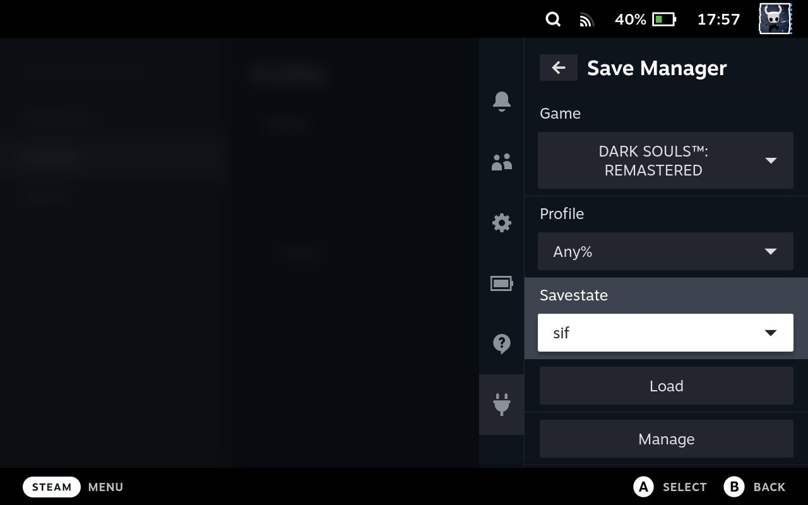

# Decky Save Manager

Steam Deck save manager plugin for [Decky Loader](https://github.com/SteamDeckHomebrew/decky-loader). Decky save manager allows you to store your save files and load them whenever you want. 

## Installation

1. Install [Decky Loader](https://deckbrew.xyz/).
2. Find the plugin in the Decky Store and install it.

## Usage

1. Add game (You need to know the location of the save file)
   - You can use "Add current game" button if there is a running game at the moment.
2. Create a profile. Name it anything you want.
3. Create a savestate. This will backup the save file.
4. Now you can load the savestate from the main menu.